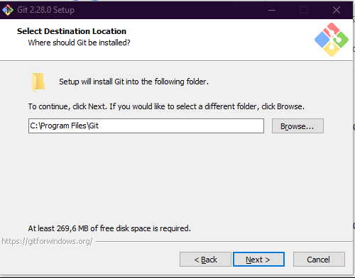
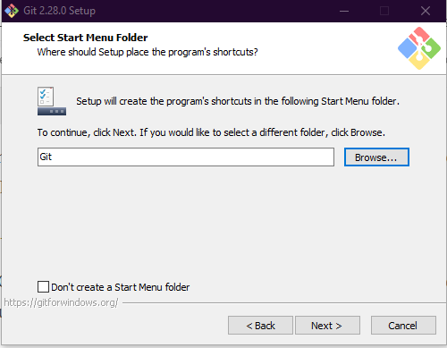
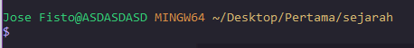
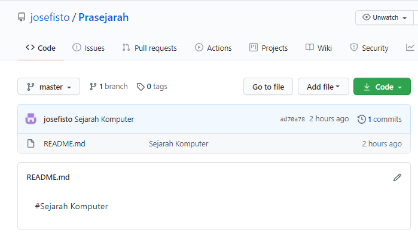

	# Bahasa Pemrograman

	## Tugas Version Control System

	Dosen : Agung Nugroho, M.Kom

 
	<b>Tugas untuk memenuhi syarat penilain pada Pert-4</b>

	

                 Nama : Jose Fisto

                 NIM : 312010119

                 Kelas : TI.20 A.1

	

	<b>UNIVERSITAS PELITA BANGSA</b>

	<b>FAKULTAS TEKNIK</b>

	<b>TEKNIK INFORMATIKA</b>

	<b>TA 2020 / 2021</b>

# GIT
Selamat berkunjung di repository saya, semoga dengan artikel ini dapat berguna bagi teman - teman untuk membantu bagaiamana cara menggunakan *GIT* pada awalnya. Pada artikel ini saya akan memberikan langkah - langkah instalasi dan cara menggunakan git untuk yang mendasar.

**Daftar Isi**
* [Apa itu GIT](#apa-itu-git)
* [Bagaimana cara menggunakan GIT](#bagaimana-cara-menggunakan-git)
    * [Instalasi GIT](#instalasi-git)
* [Penggunaan GIT](#penggunaan-git)
    * [Menambahkan Global Config](#menambahkan-global-config)
    * [Perintah Dasar Git](#perintah-dasarigit)
    * [Membuat Repository Local](#repository-local)
    * [Menambahkan File baru pada repository](#menambahkan-file-baru-pada-repository)
    * [*Commit* (Menyimpan perubahan ke database)](#*commit*-(menyimpan-perubahan-ke-database))
    * [Membuat repository server](#membuat-repository-server)
    * [Menambah Remote Repository](#menambah-remote-repository)
    * [Push (Mengirim perubahan ke server)](#push-(mengirim-perubahan-ke-server))
    * [Melihat hasilnya pada server repository](#melihat-hasilnya-pada-server-repository)
    * [Clone Repository](#clone-repository)
* [Penutup](#Penutup)
    
## Apa itu GIT

  **GIT** adalah salah satu sistem pengontrol versi (Version Control System) pada proyek perangkat lunak yang diciptakan oleh Linus Torvalds. Pengontrol versi bertugas mencatat setiap perubahan pada file proyek yang dikerjakan oleh banyak orang maupun sendiri.
 Git dikenal juga dengan distributed revision control (VCS terdistribusi), artinya penyimpanan database Git tidak hanya berada dalam satu tempat saja.

## Bagaimana cara menggunakan GIT
Untuk pertama kali atau baru mencoba kita bingung bagaimana caranya menggunakan git begitu juga saya demikian pada awalnya, disini saya akan memberitahu kepada kalian **Bagaimana cara menggunakan GIT** jadi simaklah pada langkah - langkah dibawah ini.

### Instalasi GIT
Hal pertama yang harus kita lakukan adalah instalasi GIT pada komputer atau laptop pada laptop. berikut ini adalah bagaimana cara instalasi git dan penjelasan dari beberapa intruksi yang akan di instalasi nantinya.

untuk instalasi perhatikan hal - hal yang harus di lakukan pada langkah berikut ini :

1. Pertama, kunjungi link website https://git-scm.com/ untuk instalasi GIT
2. Jika sudah di beranda website, kita klik pada tulisan `Download 2.28.0 for Windows` untuk lebih jelas lihat pada gambar kotak hijau dibawah ini

      

3. Jika sudah maka installer git akan terdownload dan tunggu hingga selesai, langkah berikutnya buka installer git yang sudah terdownload dengan cara klik 2x atau klik kanan `Run as administrator`

      

4. Di Tahap Installer awal akan di tampilkan pengenalan dan informasi untuk menggunakan GIT. Jika sudah membaca atau di skip lalu klik `Next` untuk melanjutkan instalasi.

      

5. Selanjutnya tentukan destinasi atau tempat folder GIT yang akan kita taruh nanti, disini saya otomatis atau default.

      

6. Kemudian pilih komponen tambahan untuk install Git. Fungsi komponen ini adalah untuk memperlancar penggunaan Git dan mendukung file dengan kapasitas besar. Sesuaikan komponen tambahan yang dipilih seperti pada gambar di bawah ini. Jika sudah klik `Next` untuk melanjutkan instalasi.

      

7. Tentukan nama aplikasi GIT yang akan di tampilkan nanti di pencarian windows. Disini saya mengikuti default dari installer GIT.

      

8. Untuk mengedit script melalui Git, kita memerlukan file editor. Teman - teman bebas menggunakan file editor apa pun untuk dikombinasikan dengan Git. Pilih default atau bawaan dari installer GIT. Klik `Next`, apabila sudah menentukan file editor yang akan digunakan

      

9. Path Environment berfungsi untuk mengeksekusi perintah perintah pada Git. Pilih **Git from the command line and also from 3rd-party software** agar saat menjalankan perintah Git dapat dikenali di **Command Prompt (CMD)** pada Windows. Lalu Klik `Next`

      

10. Kemudian mengeksekusi SSH. Pilih Use OpenSSL, aplikasi default SSL dari Git. Klik `Next` untuk melanjutkan instalasi.

      

11. Selanjutnya, pada langkah ini perlu memilih pengaturan line ending. Pada tutorial ini kami memilih **Checkout Windows-style, commit Unix-style line endings**. Klik `Next` untuk melanjutkan instalasi.

      

12. Setelah itu, disini terdapat 2 opsi, opsi pertama kita bisa gunakan MinTTY atau Command Prompt. Pada step ini saya menggunakan dengan CMD (Command Prompt), Maka saya memilih **Use Windows’ default console windows**. Klik `Next` untuk melanjutkan instalasi.

      

13. Disini saya memilih `Default`. Pada opsi ini kita bisa melakukan gitpull langsung dari server git, jika tidak bisa maka bisa membuat dengan metode penggabungan komit. Klik `Next` untuk melanjutkan instalasi.

      

14. Pilih **Git Credential Manager** agar Git bisa dikombinasikan dengan aplikasi lain seperti Visual Studio, Android Studio, dan GitHub. Klik `Next` untuk melanjutkan instalasi. 

      

15. Pilih Enable **File System Caching** agar Git memiliki fungsi system caching. Kedua, Klik `Next` untuk melanjutkan instalasi.

      

16. Setelah menambahkan konfigurasi ekstra pada Git, maka bisa memulai proses instalasi Git. Klik Install untuk melanjutkan proses.

      

    Berikut ini adalah tampilan proses instalasi Git. Tunggu hingga proses selesai dan teman - teman bisa menggunakan Git pada Windows.

      
      
17. Setelah proses instalasi selesai, cek terlebih dahulu apakah instalasi Git berhasil atau tidak. Cek bisa dilakukan melalui Command Prompt. Klik Win+R lalu ketik CMD untuk membuka Command Prompt seperti di bawah ini.

      
      
    Selanjutnya masukkan perintah berikut `git --version` untuk cek versi git dan cek apakah Git sudah terinstall di komputer teman - teman. jika sudah maka tampilan akan di bawah seperti ini
      
      

## Penggunaan GIT

 Cara Menggunakan Git
Setelah berhasil install ke Git, ikuti beberapa langkah untuk menggunakan Git. Berikut ini merupakan langkah menggunakan Git :

### Menambahkan Global Config

 Pertama kali untuk menggunakan GIT, kalian bisa mendaftarkan diri atau menggunakan akun GitHub, Gitlab, atau Bitbucket. Jika sudah mendaftarkan diri buka Command Prompt (CMD) pada komputer atau laptop kalian dan tuliskan perintah - perintah di bawah ini lalau kita eksekusikan atau jalankan.

   * `git config --global user.name “nama_user”`
   
      digunakan untuk menyertakan nama pengguna dari akun git, hasilnya di bawah ini
   
      
   
   * `git config --global user.email “nama_user”`
       
      digunakan untuk menyertakan pengguna email dari akun git, hasilnya di bawah ini
      
      
   
   * `git config --list`

      untuk mengetahui bahwa akun sudah terdaftar atau tidak, hasilnya di bawah ini

      
      
### Perintah Dasar Git

 Ketahui terlebih dahulu perintah - perintah dasar untuk memulai menggunakan git, berikut ini adalah perintah - perintah yang digunakan git.

   `git init`, perintah untuk membuat repository local
   
   `git add`, perintah untuk menambahkan file baru, atau perubahan pada file pada staging sebelum proses commit
   
   `git commit`, perintah untuk menyimpan perubahan kedalam database git
   
   `git push -u origin master`, perintah untuk mengirim perubahan pada repository local menuju server repository
   
   `git clone [url]`, perintah untuk membuat working directory yang diambil dari repositry sever
   
   `git remote add origin [url]`, perintah untuk menambahkan remote server/reopsitory server pada local repositry (working directory)
   
   `git pull`, perintah untuk mengambil/mendownload perubahan terbaru dari server repository ke local repository

### Membuat Repository Local

 Membuat Repository Local, ikutilah langka - langka berikut ini untuk Repository Local

   * Buat direktori dengan nama bebas, untuk lokasi direktori bebas bisa di C:/ ataupun D:/, disini saya lokasi direktory di **C:\Users\Jose Fisto\Desktop\Pertama**. folder tersebut nantinya untuk menyimpan update file dari repository GitHub yang telah dibuat
   
      

   * jika sudah, selanjutnya kita buka direktory yamg sudah dibuat dengan cara klik kanan lalu pilih `Git Bash Here`, jika sudah nanti akan teralihkan ke *Git bash command*
   
      
   
   * Buat direktori proyek praktikum pertama dengan nama apa saja, disini saya menamakannya "Sejarah". dengan perintah di bawah ini

      `mkdir Sejarah`
      
      
   
   * Jika sudah maka terbentuk satu direktori baru dibawahnya, selanjutnya masuk kedalam direktori tersebut dengan perintah cd (change
directory)

      `cd Sejarah`
      
      
   
   * maka nanti direktory akan menjadi C:\Users\Jose Fisto\Desktop\Pertama\Sejarah
   
      
   
   * Jalankan perintah `git init`, untuk membuat repository local
   
      
      
   * Repository baru berhasil di inisialisasi, dengan terbentuknya satu direktori hidden dengan nama .git
   
   * Pada direktori tersebut, semua perubahan pada working directori akan disimpan.

### Menambahkan File baru pada repository
   
   * Untuk membuat file dapat menggunakan text editor, lalu menyimpan filenya pada direktori aktif (repository)
   
   * disini kita akan coba buat satu file bernama README.md (text file)
   
     `$ echo “#Sejarah Komputer” >> README.md`
   
   * File **README.md** berhasil dibuat
   
      
   
   * Untuk menambahkan file yang baru saja dibuat tersebut gunakan perintah git add
     
     `$ git add README.md`
     
   * File README.md berhasil ditambahkan.
   
      
   
### *Commit* (Menyimpan perubahan ke database)

   * Untuk menyimpan perubahan yang ada kedalam database repository local, gunakan perintah git commit -m “komentar commit”
   
     `$ git commit -m “Sejarah Komputer"`
     
   * Perubahan berhasil disimpan.
   
      

### Membuat repository server

   * Server reopsitory yang akan kita gunakan adalah http://github.com
   
   * Teman - teman harus membuat akun terlebih dahulu
   
   * Pada laman github, klik tombol start a project, atau
   
   * Dari menu (icon +) klik New Repository
   
      

   * Isi nama repositorynya, misal: Prasejarah

   * lalu klik tombol Create repository.
   
      
   
### Menambah Remote Repository

   * Remote Repository merupakan repository server yang akan digunakan untuk menyimpan setiap perubahan pada local repository,
sehingga dapat diakses oleh banyak user

   * Untuk menambahkan remote repository server, gunakan perintah **git remote add origin [url]**.
     
     `$ git remote add origin https://github.com/josefisto/Prasejarah.git`
     
      
      
### Push (Mengirim perubahan ke server)

   * Untuk mengirim perubahan pada local repository ke server gunakan perintah git push
        
        `$ git push -u origin master`
   * Perintah ini akan meminta memasukkan username dan password pada akun github.com.
   
      
     
### Melihat hasilnya pada server repository

   * Buka laman github.com, arahkan pada repositorinya
   
   * Maka perubahan akan terlihat pada laman tersebut
   
      
      
 ### Clone Repository
 
   * Clone repository, pada dasarnya adalah meng-copy repository server dan secara otomatis membuat satu direktory sesuai dengan nama repositorynya (working directory)
   
   * Untuk melakukan cloning, gunakan perintah `git clone [url]`.
   
      

# Penutup

Berdasarkan di atas merupakan tata cara menggunakan git, semoga ilmu di atas dapat bermanfaat untuk teman - teman dan di gunakan sebaik mungkin. apabila ada ke kurangan teman - teman bisa memberi saran dengan begitu saya dapat menambahkannya atau dapat memahami lebih dalam lagi.

Sekian dari saya Terima Kasih.....

   

